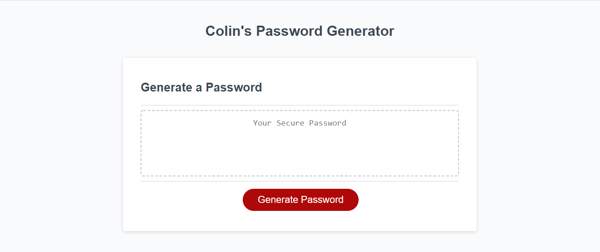

# My Password Generator

When you click the button to generate a password, you're presented with a series of prompts for password criteria.
When you're prompted for password criteria, you select which criteria to include in the password - you choose a length, and what type of characters to include in the password.
User input is validated, and when all prompts are finished being selected, a password is displayed.

Check it out here - https://niloccolin.github.io/week-3-pw-generator/